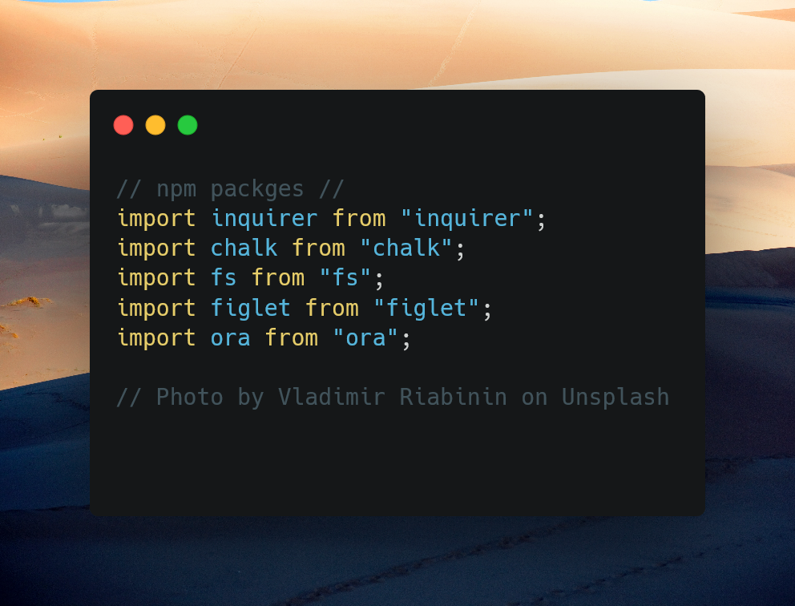

# README.MD_Maker

## Table of Contents
- [README.MD\_Maker](#readmemd_maker)
  - [Table of Contents](#table-of-contents)
  - [Description](#description)
  - [Prgoramming Lanaguage](#prgoramming-lanaguage)
  - [Contributing](#contributing)
  - [Tests](#tests)
  - [License](#license)

## Description

A README.md generator with Node.js is a command-line application that allows users to quickly and easily generate a professional README file for their project. The application prompts users for information about their project repository and then generates a README.md file with sections entitled Description, Table of Contents, Installation, Usage, License, Contributing, Tests, and Questions.

The application uses the Inquirer package for Node.js to collect user input and the file system (fs) module to write the generated README file to the file system. The user is prompted for information such as their project title, description, installation instructions, usage information, contribution guidelines, and test instructions. They can also choose a license for their application from a list of options, which will be displayed with a badge in the README file.

The generated README file is written in Markdown, a popular markup language for creating documentation, and is designed to be easy to read and understand. The README file serves as a comprehensive guide for users who want to use or contribute to the project, and is an essential component of any well-documented open-source project.

By using a README.md generator with Node.js, developers can save time and effort by automating the process of generating a professional README file. This allows them to focus on writing code and developing their projects, rather than spending time on manual documentation tasks.

## Prgoramming Lanaguage

Javascript,NodeJS

## Contributing

Packages such as inquirer, chalk, fs, figlet, and ora document have help the project more robust.

## Tests

Command-Line

## License

wtfpl

